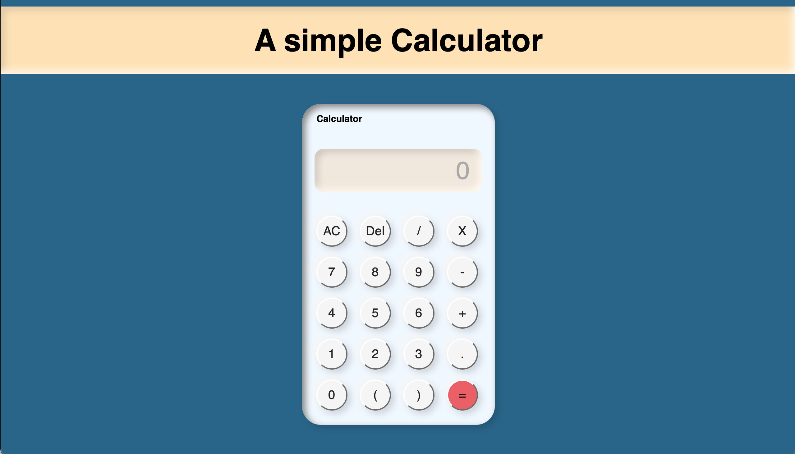

# Calculator
A simple Calculator for general purposes.

This is a web project in which i have build the Calculator interface as the website and this website calculator performs the simple calculation operations.

You can visit the website - <a href="https://vipulchauhan89.github.io/Calculator/">by clicking at this link.</a>

#

## Objective:
To develop a simple calculator using-

   __HTML__

   __CSS__

  __Javascript__

#

## Features:
* __Add__
* __Subtract__
* __Multiplication__
* __Division__
#

# This is how my calculator look's like -

#

_To build this project some of the help was taken from google and youtube._
#
